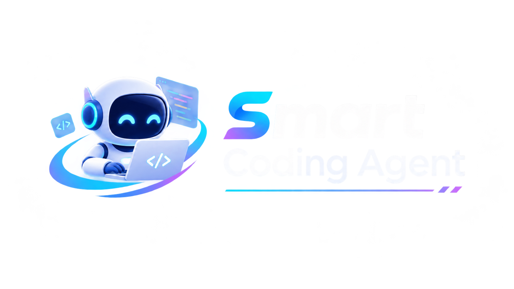
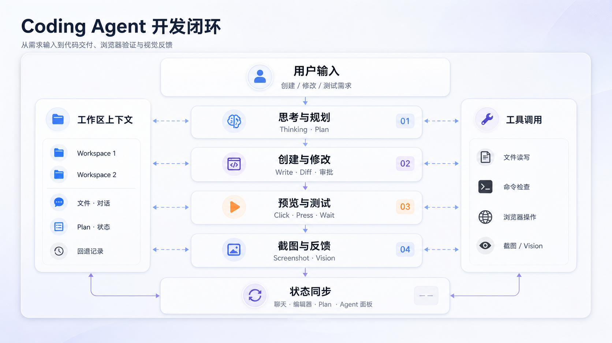
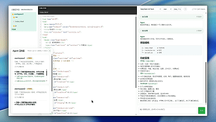
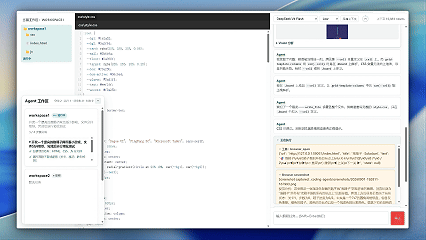
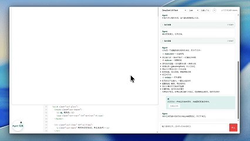

<div align="center">



# Smart Coding Agent

### From idea to working product — from the first prompt to the final test.

[GitHub Repository](https://github.com/ThomasYuan666/Coding-Agent-Main)

</div>

## 项目简介

Smart Coding Agent 是一个支持多工作区的智能编程助手。它将自然语言需求、任务规划、文件编辑、代码检查、网页预览、浏览器自动测试、截图与 Vision 分析集中在同一个实时工作流中，并提供 Diff 审批、Rollback 和上下文压缩能力。

## 核心架构



用户输入需求后，Agent 依次完成思考与规划、创建与修改、预览与测试、截图与反馈，最后将结果同步到聊天区、编辑器、Plan 和 Agent 面板。左右两侧分别代表工作区上下文与可调用工具。

## 技术栈与系统协作

- 前端：HTML、CSS、JavaScript、CodeMirror
- 服务端：FastAPI、WebSocket
- 模型：DeepSeek Tool Calling、Vision 模型
- 浏览器：Playwright
- 存储：按工作区保存的 JSON 对话、任务、摘要和回退记录

FastAPI 提供服务接口，WebSocket 推送 Agent 思考、工具调用、审批和测试状态；Agent 根据模型输出调用文件、命令和浏览器工具，前端实时展示执行结果。

## 运行方法

```bash
cd Coding-Agent-Main
python -m venv venv
# Windows PowerShell
.\venv\Scripts\Activate.ps1
pip install -r requirements.txt
playwright install chromium
```

配置 `DEEPSEEK_API_KEY` 后运行：

```bash
python main.py
```

打开 <http://127.0.0.1:8000> 即可使用。

## 特色功能与演示

### Agent 控制面板

统一查看多个工作区的运行、待审批、失败和完成状态，并快速切换当前项目。



### Diff 与审批

代码修改先以 Diff 形式展示，用户确认后才会写入工作区，新增和删除内容一目了然。


### 浏览器自动预览与测试

Agent 可以打开网页并执行点击、按键、等待和状态读取，验证页面是否真正可用。



### 自动截图与视觉反馈

网页测试过程中可以自动保存截图，并在聊天区展示页面证据和 Vision 分析结果。



## 安全与可恢复性

写入、删除和命令执行支持审批；Rollback 可以恢复文件、对话、Plan 和截图记录。每个工作区独立保存上下文，适合并行开发和长时间迭代。
